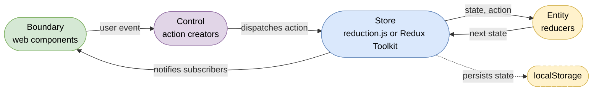

# bce.design

Quickstarter and sample application for building non-trivial web applications with minimal tooling, essential dependencies, high productivity, and no migrations.

**Web standards first, external libraries last.** Built directly on browser APIs - no framework lock-in, just native [Web Components](https://developer.mozilla.org/en-US/docs/Web/API/Web_components), [ES modules](https://developer.mozilla.org/en-US/docs/Web/JavaScript/Guide/Modules), and modern JavaScript. Visit [bce.design/web-components](https://bce.design/web-components.html) for more information.

Every external dependency is treated as a liability and continuously replaced with web standards: the Bulma CSS framework was removed in favor of plain CSS design tokens, and Redux Toolkit is superseded by [reduction.js](app/src/reduction.js), a minimal standards-based store built on [structuredClone](https://developer.mozilla.org/en-US/docs/Web/API/Window/structuredClone). The single remaining runtime library is [lit-html](https://lit.dev/docs/libraries/standalone-templates/) for declarative templating. The complete replacement log: [from dependencies to web standards](#from-dependencies-to-web-standards).

> [!TIP]
> LLMs love stable web standards: [airails.dev](https://airails.dev) ...and developers predictability: [sbce.dev](https://sbce.dev). This project's architecture rules are captured in the [web-components skill](https://github.com/AdamBien/airails/tree/main/web/web-components).

## Core Architecture

This project implements **unidirectional data flow** with a Redux-style store for predictable state management. All state changes flow in one direction: Actions → Reducers → Store → View Components. The application follows the Boundary Control Entity (BCE) pattern for clear separation of concerns.

Two interchangeable store implementations are provided, selected via the import map in `app/src/index.html`: [reduction.js](app/src/reduction.js) (active default) — a minimal, standards-based implementation of the used Redux Toolkit API (`configureStore`, `createAction`, `createReducer`) that relies on [structuredClone](https://developer.mozilla.org/en-US/docs/Web/API/Window/structuredClone) instead of Immer — or the original [Redux Toolkit](https://redux-toolkit.js.org) vendored in `app/src/libs/`. Application code imports `@reduxjs/toolkit` either way; switching is a one-line import map change.

 with web components" height="400"/>

# run

There is nothing to build. Serve `app/src` with any static web server that falls back to `index.html` for unknown paths (required for client-side routing), e.g. with [zws](https://github.com/adamBien/zws) (zero dependencies web server, requires Java):

```bash
cd app/src
zws.sh --single
```

For deployment, copy `app/src` to any static host — an S3 bucket, a CDN, or the `META-INF/resources/` folder of a [Quarkus](https://quarkus.io) backend.

[](https://www.youtube.com/embed/LYzGgCW0OxY?rel=0)


## e2e tests

The e2e tests are available from:

[tests](./tests/)

## code coverage

The e2e tests with configured global code coverage is available from: [codecoverage](./codecoverage/)

# IDE

1. [Visual Studio Code](https://code.visualstudio.com)
2. Setup: [JS imports](https://www.adam-bien.com/roller/abien/entry/fixing_es_6_import_autocompletion)
3. lit-html [plugin](https://marketplace.visualstudio.com/items?itemName=bierner.lit-html) for syntax highlighting inside html templates
4. redux devtools chrome [extension](https://github.com/zalmoxisus/redux-devtools-extension)

# update dependencies

There is no build system. Runtime dependencies are vendored as self-contained ES modules in `app/src/libs/` and mapped via the import map in `index.html`. lit-html ships as a single dependency-free module, so an update is a plain file copy:

```bash
./update-lit-html.sh 3.3.3
```

# external ingredients

1. [lit-html](https://lit.dev/docs/libraries/standalone-templates/)
2. [redux toolkit](https://redux-toolkit.js.org) (optional — [reduction.js](app/src/reduction.js), a minimal built-in implementation of the used API, is the active default; switch via the import map in `index.html`)

Client-side routing is implemented with web standards: the [Navigation API](https://developer.mozilla.org/en-US/docs/Web/API/Navigation_API) and [URLPattern](https://developer.mozilla.org/en-US/docs/Web/API/URLPattern) — no router dependency required.

# standards-based routing

`app/src/app.js` declares the route table, `app/src/router.js` implements the mechanics in ~30 lines:

```javascript
initRouter(document.querySelector('.view'), [
    { path: '/',                 component: 'b-list' },
    { path: '/add',              component: 'b-bookmarks' },
    { path: '/edit/:bookmarkId', component: 'b-bookmarks' }
]);
```

Navigation is plain HTML: any `<a href="/add">` whose URL matches a route is intercepted by the Navigation API and rendered client-side — no `Router.go()`, no link components. URLPattern uses the same `:param` syntax as router libraries (both inherit it from `path-to-regexp`); named path parameters are passed to the routed component as attributes. The edit view demonstrates the pattern: the list renders `<a href="/edit/${bookmark.id}">`, the router creates `<b-bookmarks bookmarkid="...">`, and the component loads the bookmark into the form through the control layer.

Deliberate non-features: URLs matching no route fall through to regular browser navigation (external links keep working), and reloads are never intercepted (reload means reload). Both imply the serving requirement above — unknown paths must fall back to `index.html`.

# what is BCE?

Boundary Control Entity (BCE) pattern organizes code by responsibility:

- **Boundary**: UI components (Web Components) - user interaction layer
- **Control**: Business logic and orchestration - application behavior  
- **Entity**: State management and data models - domain objects

In this project:
- `bookmarks/boundary/` - UI components like List.js, Add.js
- `bookmarks/control/` - Logic like CRUDControl.js
- `bookmarks/entity/` - State like BookmarksReducer.js

The `bookmarks` BC is the sample business component that keeps this template runnable and testable. After cloning, remove or replace it with your own BCs. Removing it touches four coupling points: the imports and the route registrations in `app/src/app.js`, the `bookmarks` reducer registration in `app/src/store.js`, the `<h1>` title in `app/src/index.html`, and the e2e specs in `tests/` and `codecoverage/`.

BCE eliminates naming debates and provides instant code organization, helping avoid [Parkinson's law of triviality](https://en.wikipedia.org/wiki/Law_of_triviality). [Learn more about BCE](https://en.wikipedia.org/wiki/Entity-control-boundary)

## unidirectional data flow

State always travels the same cycle — the view never mutates state directly. A boundary web component (`Add.js`) forwards user input to the control layer (`CRUDControl.js`), which dispatches an action to the store; the entity layer reducer (`BookmarksReducer.js`) computes the next state, and the store notifies all subscribed components (`BElement.js`), which re-render via lit-html:



[](https://www.youtube.com/embed/zjtaLLs2eSM?rel=0)

## static hosting on Amazon S3

[](https://www.youtube.com/watch?v=EtvyaUJjg_E)


# from dependencies to web standards

Each external dependency was removed once a web standard could take over. The dependency name links to the commit that eliminated it:

| removed dependency | web standard replacement | in the code |
|---|---|---|
| [Vaadin Router](https://github.com/AdamBien/bce.design/commit/4dcede8) | [Navigation API](https://developer.mozilla.org/en-US/docs/Web/API/Navigation_API) + [URLPattern](https://developer.mozilla.org/en-US/docs/Web/API/URLPattern) | [router.js](app/src/router.js) |
| [Bulma CSS framework](https://github.com/AdamBien/bce.design/commit/cf4be4f) | [CSS custom properties](https://developer.mozilla.org/en-US/docs/Web/CSS/--*) as design tokens, [container queries](https://developer.mozilla.org/en-US/docs/Web/CSS/CSS_containment/Container_queries) | [tokens.css](app/src/tokens.css), [style.css](app/src/style.css) |
| [Redux Toolkit + Immer](https://github.com/AdamBien/bce.design/commit/2cdadf2) | [structuredClone](https://developer.mozilla.org/en-US/docs/Web/API/Window/structuredClone)-based store | [reduction.js](app/src/reduction.js) |
| [build system (Rollup / npm)](https://github.com/AdamBien/bce.design/commit/f4fd563) | [import maps](https://developer.mozilla.org/en-US/docs/Web/HTML/Element/script/type/importmap) + vendored ES modules | [index.html](app/src/index.html), [libs/](app/src/libs/) |
| [lit-html](https://lit.dev/docs/libraries/standalone-templates/) *(pending)* | [DOM Parts](https://github.com/WICG/webcomponents/blob/gh-pages/proposals/DOM-Parts.md) — proposal, not yet implemented in browsers | [libs/lit-html.js](app/src/libs/lit-html.js) |

lit-html is the last remaining runtime dependency — declarative templating with efficient re-rendering has no shipped web standard equivalent yet. Once DOM Parts lands, the final row completes.

# resources

## Web Standards and Browser APIs Used

- [Web Components](https://developer.mozilla.org/en-US/docs/Web/API/Web_components) - Custom Elements, Shadow DOM, HTML Templates
- [Custom Elements](https://developer.mozilla.org/en-US/docs/Web/API/Window/customElements) - Define new HTML elements
- [ES Modules](https://developer.mozilla.org/en-US/docs/Web/JavaScript/Guide/Modules) - Native JavaScript module system
- [Import Maps](https://developer.mozilla.org/en-US/docs/Web/HTML/Element/script/type/importmap) - Map bare module specifiers to URLs
- [Container Queries](https://developer.mozilla.org/en-US/docs/Web/CSS/CSS_containment/Container_queries) - Responsive layouts based on container size
- [localStorage](https://developer.mozilla.org/en-US/docs/Web/API/Window/localStorage) - Browser storage for state persistence
- [structuredClone](https://developer.mozilla.org/en-US/docs/Web/API/Window/structuredClone) - Immutable state updates in reduction.js, replacing Immer
- [JSON](https://developer.mozilla.org/en-US/docs/Web/JavaScript/Reference/Global_Objects/JSON) - Data serialization for storage
- [querySelector/querySelectorAll](https://developer.mozilla.org/en-US/docs/Web/API/Document/querySelector) - DOM element selection
- [ES6 Classes](https://developer.mozilla.org/en-US/docs/Web/JavaScript/Reference/Classes) - JavaScript class syntax
- [Template Literals](https://developer.mozilla.org/en-US/docs/Web/JavaScript/Reference/Template_literals) - String templates with embedded expressions
- [Arrow Functions](https://developer.mozilla.org/en-US/docs/Web/JavaScript/Reference/Functions/Arrow_functions) - Concise function syntax
- [Destructuring](https://developer.mozilla.org/en-US/docs/Web/JavaScript/Reference/Operators/Destructuring_assignment) - Extract values from objects/arrays
- [Spread Syntax](https://developer.mozilla.org/en-US/docs/Web/JavaScript/Reference/Operators/Spread_syntax) - Expand arrays/objects
- [Navigation API](https://developer.mozilla.org/en-US/docs/Web/API/Navigation_API) - Intercepts same-origin navigations for client-side routing
- [URLPattern](https://developer.mozilla.org/en-US/docs/Web/API/URLPattern) - Route matching without a router dependency

## Testing & Development Tools

[mockend](https://github.com/adambien/mockend) serves as a mock backend with throttling functionality.

Mockend can slow down responses, which simplifies the testing of asynchronous view updates. Fetch requests in the `control` layer can be delayed for test purposes.

Article: [Web Components, Boundary Control Entity (BCE) and Unidirectional Data Flow with redux](https://adambien.blog/roller/abien/entry/web_components_boundary_control_entity)

# AI coding agents

Guidance for AI coding agents (Claude Code, Codex, Gemini CLI, ...) is maintained in [AGENTS.md](./AGENTS.md).

powered by [airhacks.industries](https://airhacks.industries)
